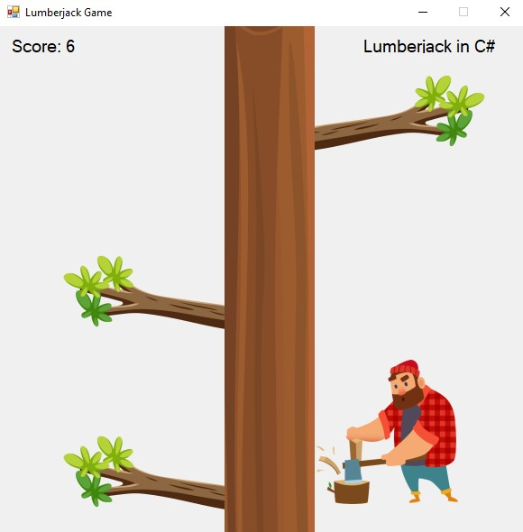

# Lumberjack Game

🌲 Welcome to Lumberjack in C# - a thrilling game of dodging branches and testing your lumberjack skills!

## Overview

In this action-packed game, you play as a fearless lumberjack tasked with chopping down a tree while avoiding deadly branches. Can you survive the challenge and become the ultimate lumberjack champion?

<div style="text-align: center;">
<h1 align="centre">
   
</h1>
</div>


## How to Play

1. **Controls:**
   - Use `A` key to move left and dodge branches.
   - Use `D` key to move right and avoid obstacles.
   - Keep an eye on falling branches and react quickly to avoid collisions.

2. **Game Elements:**
   - **Lumberjack:** You control this brave lumberjack.
   - **Tree Trunk:** Watch out for falling branches from this towering trunk.
   - **Branches:** Dodge these lethal obstacles to stay alive and score points.

3. **Scoring:**
   - Your score increases as you successfully dodge branches.
   - Each branch dodged adds to your lumberjack skills and reputation!

4. **Game Over:**
   - The game ends if a branch hits you. Stay sharp and agile to survive!
   - Reach the time limit to see your final score and compare with friends.

## Installation

To play the game, follow these steps:

1. **Clone the Repository:**
   ```bash
   git clone https://github.com/karthikeyakondabathula/LumberJack_CSharp.git
   ```

2. **Open the Project:**
   - Open the project in Visual Studio or your preferred C# IDE.

3. **Build and Run:**
   - Build the project and run it to start playing the game.

## Game Development

This game was developed using C# and Windows Forms, providing an exciting gameplay experience for players of all ages. Customize and enhance the game as you like to create your unique lumberjack adventure!

Are you ready to test your lumberjack skills and conquer the forest? Let's chop some wood and dodge those branches! Happy gaming!


Feel free to modify the text further to match your style or add more details about the gameplay or game features.

<hr>

Join the Lumberjack Challenge and Let's Chop Some Wood! 🪓🌲

<br><br>


<div align="center">
  
</div>
